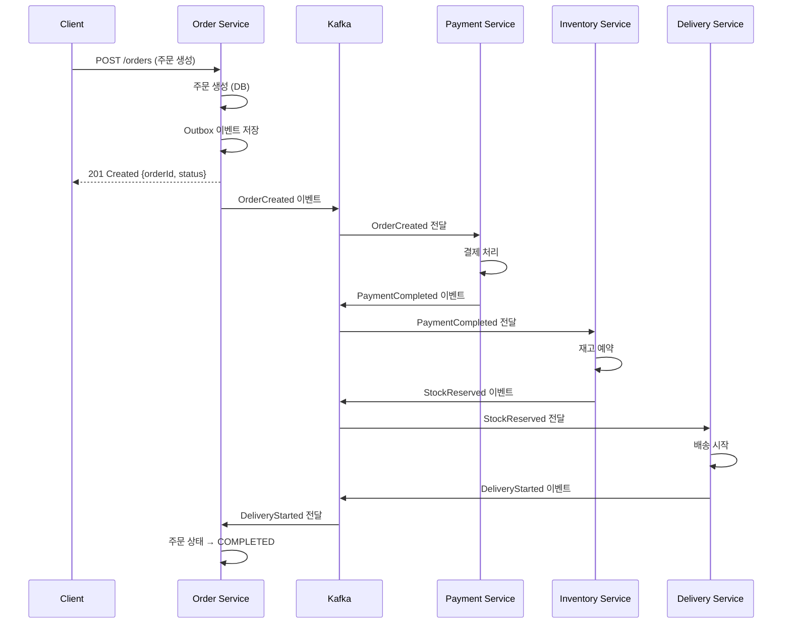
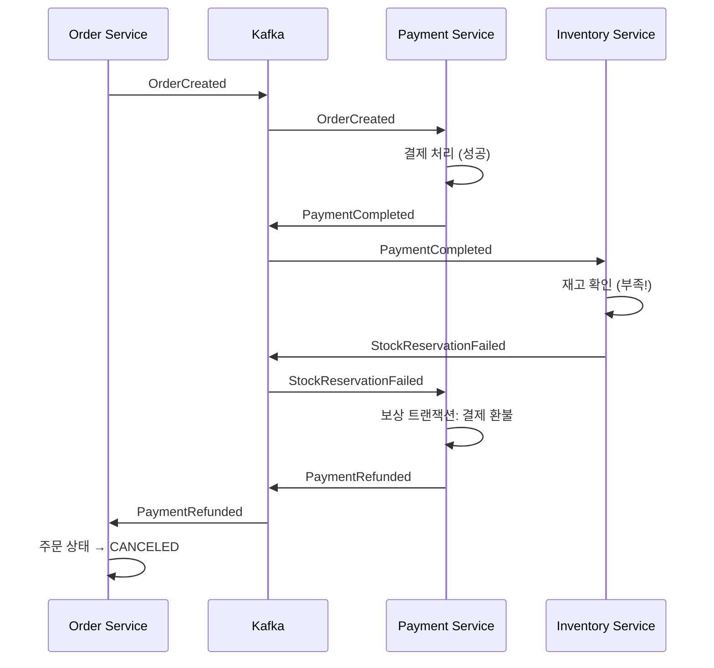

# 아키텍처 상세 문서

## 📐 시스템 아키텍처

### 전체 구조

```
┌─────────────────────────────────────────────────────────────────────┐
│                          Client Layer                                │
└─────────────────────────────────────────────────────────────────────┘
                                │
                    ┌───────────┴───────────┐
                    │                       │
        ┌───────────▼──────────┐ ┌─────────▼──────────┐
        │   Order Service      │ │  Other Services    │
        │   (Entry Point)      │ │  (Direct Access)   │
        └───────────┬──────────┘ └────────────────────┘
                    │
        ┌───────────▼──────────────────────────────────────┐
        │             Event Bus (Kafka)                    │
        │  Topics: order.*, payment.*, stock.*, delivery.* │
        └───────────┬──────────────────────────────────────┘
                    │
        ┌───────────┼───────────┬───────────┬─────────────┐
        │           │           │           │             │
┌───────▼──────┐ ┌─▼─────────┐ ┌▼──────────┐ ┌──────────▼──┐
│   Payment    │ │ Inventory │ │ Delivery  │ │   Order     │
│   Service    │ │  Service  │ │  Service  │ │  (Updates)  │
└───────┬──────┘ └─┬─────────┘ └┬──────────┘ └──────────┬──┘
        │          │            │                        │
        └──────────┴────────────┴────────────────────────┘
                            │
                ┌───────────▼────────────┐
                │   Data Persistence     │
                │  PostgreSQL (각 서비스)  │
                │  Redis (멱등성/캐시)     │
                └────────────────────────┘
```

## 🔄 SAGA 패턴 상세

### Choreography 패턴 플로우

#### 성공 시나리오



#### 실패 시나리오 (재고 부족)



## 🗄️ 데이터베이스 설계

### Order Service Schema

```sql
-- 주문 테이블
CREATE TABLE orders (
    id BIGSERIAL PRIMARY KEY,
    user_id BIGINT NOT NULL,
    amount BIGINT NOT NULL,
    quantity INT NOT NULL,
    status order_status NOT NULL DEFAULT 'PENDING',
    version BIGINT NOT NULL DEFAULT 0,  -- Optimistic Lock
    idempotency_key VARCHAR(64) UNIQUE, -- 멱등성 보장
    created_at TIMESTAMPTZ NOT NULL,
    updated_at TIMESTAMPTZ NOT NULL
);

-- Outbox 이벤트 테이블
CREATE TABLE outbox_events (
    id BIGSERIAL PRIMARY KEY,
    aggregate_type VARCHAR(50) NOT NULL,
    aggregate_id BIGINT NOT NULL,
    event_type VARCHAR(50) NOT NULL,
    payload JSONB NOT NULL,
    status VARCHAR(20) NOT NULL DEFAULT 'PENDING',
    created_at TIMESTAMPTZ NOT NULL,
    sent_at TIMESTAMPTZ
);

-- SAGA 인스턴스 추적
CREATE TABLE saga_instances (
    id BIGSERIAL PRIMARY KEY,
    saga_id VARCHAR(64) NOT NULL UNIQUE,
    saga_type VARCHAR(50) NOT NULL,
    order_id BIGINT NOT NULL,
    status VARCHAR(20) NOT NULL,
    current_step VARCHAR(50),
    payload JSONB,
    created_at TIMESTAMPTZ NOT NULL,
    updated_at TIMESTAMPTZ NOT NULL
);
```

### Payment Service Schema

```sql
CREATE TABLE payments (
    id BIGSERIAL PRIMARY KEY,
    order_id BIGINT NOT NULL,
    amount BIGINT NOT NULL,
    payment_type VARCHAR(20) NOT NULL DEFAULT 'CARD',
    status payment_status NOT NULL DEFAULT 'PENDING',
    idempotency_key VARCHAR(64) NOT NULL UNIQUE,
    payment_gateway_tx_id VARCHAR(100),
    reason VARCHAR(500),
    created_at TIMESTAMPTZ NOT NULL,
    updated_at TIMESTAMPTZ NOT NULL
);
```

### Inventory Service Schema

```sql
CREATE TABLE inventory (
    id BIGSERIAL PRIMARY KEY,
    product_id BIGINT NOT NULL UNIQUE,
    product_name VARCHAR(200) NOT NULL,
    available_quantity INT NOT NULL DEFAULT 0,
    reserved_quantity INT NOT NULL DEFAULT 0,
    version BIGINT NOT NULL DEFAULT 0,  -- Optimistic Lock
    created_at TIMESTAMPTZ NOT NULL,
    updated_at TIMESTAMPTZ NOT NULL
);

CREATE TABLE stock_reservations (
    id BIGSERIAL PRIMARY KEY,
    order_id BIGINT NOT NULL,
    product_id BIGINT NOT NULL,
    quantity INT NOT NULL,
    status reservation_status NOT NULL DEFAULT 'RESERVED',
    idempotency_key VARCHAR(64) NOT NULL UNIQUE,
    expired_at TIMESTAMPTZ,
    created_at TIMESTAMPTZ NOT NULL,
    updated_at TIMESTAMPTZ NOT NULL
);
```

## 🎯 핵심 디자인 패턴

### 1. Outbox 패턴

**문제**: DB 트랜잭션 커밋과 메시지 발행 사이의 원자성 보장

**해결**:
1. 비즈니스 엔티티와 Outbox 이벤트를 **같은 트랜잭션**에 저장
2. 별도 Worker가 Outbox 테이블을 폴링하여 Kafka로 발행
3. 발행 후 `SENT` 상태로 업데이트

**장점**:
- At-least-once 전달 보장
- 네트워크 장애에도 안전
- 이벤트 순서 보장 가능

### 2. 멱등성 (Idempotency)

**문제**: 중복 메시지 처리, 클라이언트 재시도

**해결 전략**:

#### A. DB Unique Constraint
```sql
CREATE UNIQUE INDEX ON payments(idempotency_key);
```

#### B. Redis SetNX
```go
reserved, _ := redis.SetNX(ctx, "idem:"+key, "1", 24*time.Hour)
if !reserved {
    return nil // 이미 처리됨
}
```

#### C. 이벤트 ID 기반
```go
if processed, _ := idemStore.IsProcessed(ctx, evt.EventID); processed {
    return nil
}
// 처리 후
_ = idemStore.Reserve(ctx, evt.EventID, 24*time.Hour)
```

### 3. Semantic Lock (상태 기반 잠금)

**문제**: 분산 환경에서의 동시성 제어

**해결**:
```go
// 허용된 상태 전이만 가능
func (o *Order) CanTransitionTo(newStatus OrderStatus) bool {
    transitions := map[OrderStatus][]OrderStatus{
        OrderStatusPending: {
            OrderStatusPaymentProcessing,
            OrderStatusCanceled,
        },
        // ...
    }
    return isAllowed(o.Status, newStatus, transitions)
}

// DB 레벨에서도 체크
UPDATE orders
SET status = 'PAYMENT_PROCESSING'
WHERE id = $1 AND status = 'PENDING'
```

### 4. Optimistic Locking

**문제**: 동시 업데이트 충돌

**해결**:
```go
// Version 필드 기반
UPDATE inventory
SET available_quantity = available_quantity - $1,
    version = version + 1
WHERE product_id = $2 AND version = $3

if rowsAffected == 0 {
    return ErrVersionConflict // 재시도
}
```

## 🔐 보안 고려사항

### 1. API 보안
- [ ] JWT 기반 인증/인가
- [ ] Rate Limiting
- [ ] Input Validation

### 2. 서비스 간 통신
- [ ] mTLS (Mutual TLS)
- [ ] Service Mesh (Istio)

### 3. 데이터 보안
- [ ] DB 암호화 (at rest)
- [ ] TLS 통신 (in transit)
- [ ] 민감 정보 마스킹

## 📊 성능 최적화

### Kafka 최적화

```yaml
# Producer 설정
acks: all                    # 모든 replica 확인
compression.type: snappy     # 압축
batch.size: 16384           # 배치 크기
linger.ms: 10               # 배치 대기 시간

# Consumer 설정
max.poll.records: 500       # 한번에 가져올 레코드 수
fetch.min.bytes: 1024       # 최소 페치 크기
```

### DB Connection Pool

```go
db.SetMaxOpenConns(25)           // CPU 코어 수 * 2-4
db.SetMaxIdleConns(10)           // MaxOpenConns의 30-50%
db.SetConnMaxLifetime(5 * time.Minute)
db.SetConnMaxIdleTime(2 * time.Minute)
```

### Redis 최적화

```go
redis.NewClient(&redis.Options{
    PoolSize:     10,
    MinIdleConns: 5,
    MaxRetries:   3,
    DialTimeout:  5 * time.Second,
    ReadTimeout:  3 * time.Second,
    WriteTimeout: 3 * time.Second,
})
```

## 🔍 모니터링 메트릭

### 비즈니스 메트릭
- 주문 성공률
- 평균 주문 처리 시간
- SAGA 실패율
- 보상 트랜잭션 발생 빈도

### 기술 메트릭
- Kafka Consumer Lag
- DB Connection Pool 사용률
- API 응답 시간 (P50, P95, P99)
- 에러율 (4xx, 5xx)

### 알림 규칙
```yaml
- SAGA 실패율 > 5% (5분 평균)
- Consumer Lag > 10000
- API P95 응답 시간 > 1초
- DB Connection Pool 사용률 > 80%
```

## 🧪 테스트 전략

### 단위 테스트
- 도메인 로직
- Repository
- Service 레이어

### 통합 테스트
- Outbox Worker
- Event Handler
- DB 트랜잭션

### E2E 테스트
- 성공 시나리오
- 실패/보상 시나리오
- 멱등성 검증

### 카오스 엔지니어링
- 네트워크 파티션 시뮬레이션
- 서비스 장애 주입
- 메시지 지연/손실 테스트

